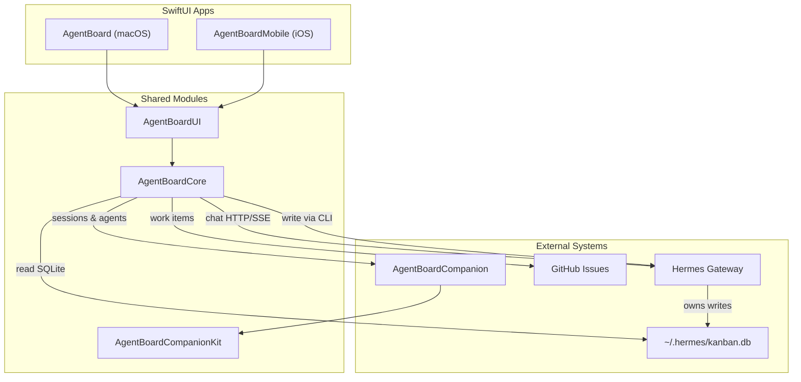

# AgentBoard

Hermes-first AgentBoard is a native SwiftUI workspace for iOS and macOS. It gives us one shared app core for chat, GitHub issue tracking, agent task/session monitoring, and companion-backed live state.

## What it is

- `AgentBoard` is the macOS app shell built with `NavigationSplitView`.
- `AgentBoardMobile` is the iOS app shell built with `TabView` and `NavigationStack`.
- `AgentBoardCore` holds the shared stores, models, services, persistence, and bootstrap logic.
- `AgentBoardCompanion` is a local Swift service for agent session monitoring and live events.

The old OpenClaw/beads/macOS-only prototype has been retired from the codebase. The active app is the SwiftUI rebuild.

## Product shape

- **Hermes gateway** powers chat (HTTP + SSE streaming via an OpenAI-compatible `/v1/chat/completions` endpoint) and is the write authority for kanban tasks via the `hermes kanban` CLI.
- **`~/.hermes/kanban.db`** is the source of truth for the Kanban board — tasks, comments, and runs all live here.
- **GitHub Issues** are tracked as work items for issue triage and reference.
- **AgentBoardCompanion** owns agent session monitoring (tmux/process discovery) and live execution state.
- SwiftData caches local snapshots for chat, work items, and sessions.
- Observation and Swift Concurrency are used throughout the shared core.

## Repo layout

```text
AgentBoard/             macOS app shell
AgentBoardMobile/       iOS app shell
AgentBoardUI/           shared SwiftUI screens and components
AgentBoardCore/         models, stores, services, persistence
AgentBoardCompanion/    companion service executable
AgentBoardCompanionKit/ companion server and SQLite store
AgentBoardTests/        Swift Testing coverage for the shared stack
SharedResources/        app icon and shared asset catalog
docs/                   architecture, ADRs, readiness notes
```

## Requirements

- macOS 26+
- iOS 26+
- Xcode 26.4+
- Swift 6
- [XcodeGen](https://github.com/yonaskolb/XcodeGen)
- [SwiftLint](https://github.com/realm/SwiftLint)

## Build and test

```bash
# one-shot setup (macOS): installs xcodegen + swiftlint, generates the project, installs hooks
./scripts/setup.sh

# regenerate after project.yml edits
xcodegen generate

# macOS app
xcodebuild -project AgentBoard.xcodeproj \
  -scheme AgentBoard \
  -destination 'platform=macOS' \
  build \
  CODE_SIGN_IDENTITY="" CODE_SIGNING_REQUIRED=NO CODE_SIGNING_ALLOWED=NO

# shared-core tests
xcodebuild test \
  -project AgentBoard.xcodeproj \
  -scheme AgentBoard \
  -destination 'platform=macOS' \
  CODE_SIGN_IDENTITY="" CODE_SIGNING_REQUIRED=NO CODE_SIGNING_ALLOWED=NO

# iOS app
xcodebuild -project AgentBoard.xcodeproj \
  -scheme AgentBoardMobile \
  -destination 'generic/platform=iOS Simulator' \
  build \
  CODE_SIGN_IDENTITY="" CODE_SIGNING_REQUIRED=NO CODE_SIGNING_ALLOWED=NO

# companion tool
xcodebuild -project AgentBoard.xcodeproj \
  -scheme AgentBoardCompanion \
  -destination 'platform=macOS' \
  build \
  CODE_SIGN_IDENTITY="" CODE_SIGNING_REQUIRED=NO CODE_SIGNING_ALLOWED=NO

# lint
swiftlint lint --strict
```

## Architecture



## Core stores

- `ChatStore` handles Hermes configuration, health, history, streaming, and reconnect.
- `WorkStore` aggregates GitHub issues into neutral `WorkItem` models.
- `AgentsStore` manages the Kanban board — reads tasks from `~/.hermes/kanban.db` via `KanbanDataService` and writes via `KanbanCLIWriter` (`hermes kanban` CLI subprocess).
- `SessionsStore` tracks live agent sessions and session details from the companion service.
- `SettingsStore` persists Hermes, GitHub, and companion configuration.

## Kanban backend

Task state lives entirely in `~/.hermes/kanban.db`. AgentBoard is a read-mostly viewer with write-through via the Hermes CLI:

```
Read  → KanbanDataService  → SQLite (kanban.db, direct open/read/close)
Write → KanbanCLIWriter    → hermes kanban CLI → Hermes Gateway Dispatcher
```

Key model types: `KanbanTask`, `KanbanComment`, `KanbanRun`, `KanbanCreateDraft`.

## Companion service

`AgentBoardCompanion` is a local Swift executable backed by SQLite. It exposes REST plus a live event stream for session monitoring. It discovers running agent processes via `ps` and captures tmux pane output. The companion is the source of truth for **live session state**; kanban task state lives in `~/.hermes/kanban.db`.

## Notes for contributors

- `project.yml` is the source of truth. Do not hand-edit `AgentBoard.xcodeproj/project.pbxproj`.
- Both app targets intentionally require the newest OS releases so the code can stay SwiftUI-first without compatibility layers.
- The shared core should stay free of platform conditionals except where framework wrappers are unavoidable.

## Archived docs

- [DESIGN.md](./DESIGN.md)
- [IMPLEMENTATION-PLAN.md](./IMPLEMENTATION-PLAN.md)
- [CLAUDE.md](./CLAUDE.md)

Those files now document the retired pre-Hermes prototype and remain only as historical context.
