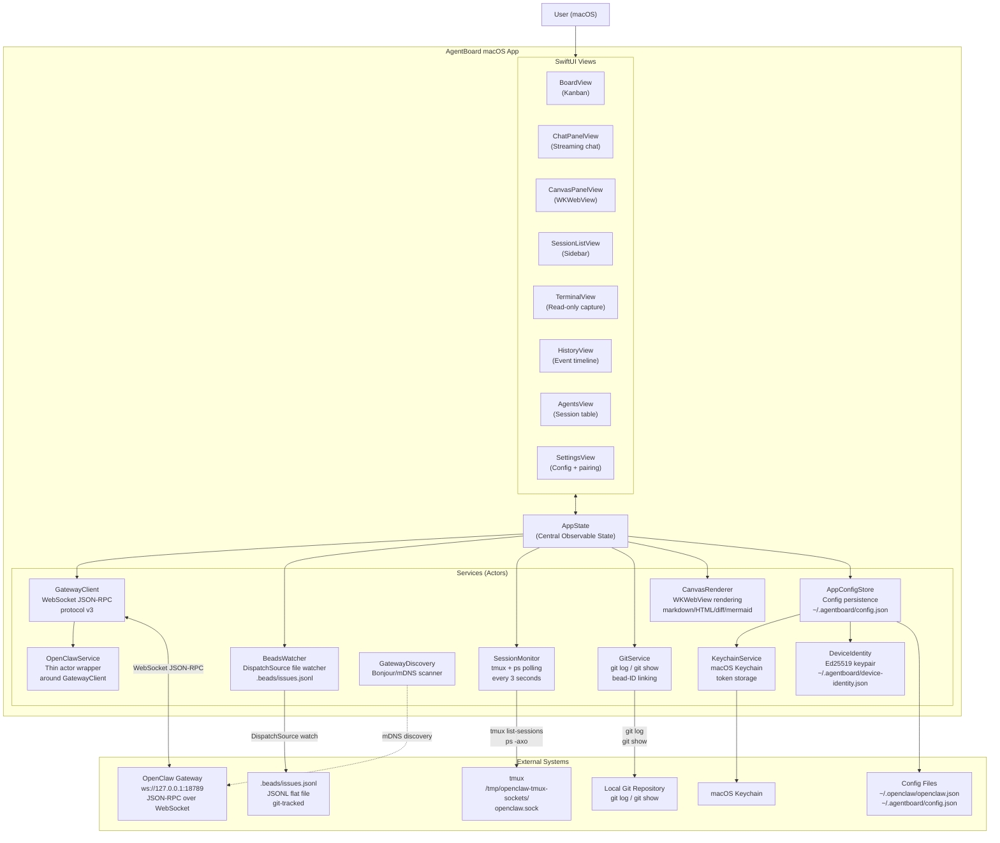
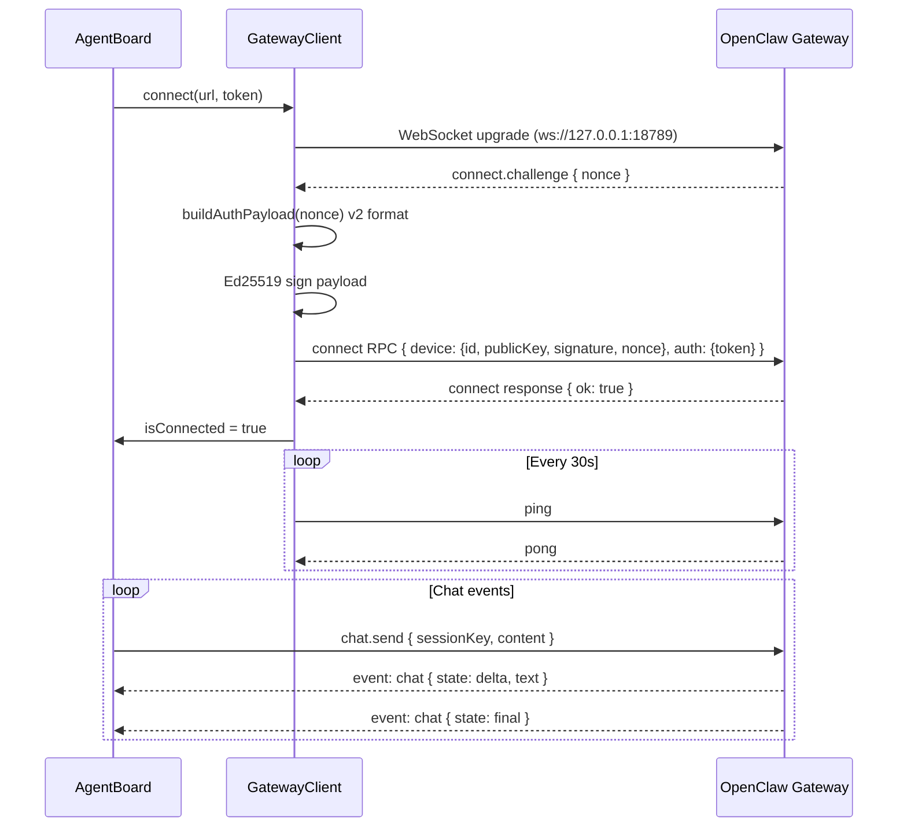

# AgentBoard — Service Architecture

## Three-Panel Layout

```
┌────────────────┬──────────────────────────┬──────────────────┐
│   Sidebar      │     Center Panel          │  Right Panel     │
│   (220 pt)     │     (flexible)            │  (resizable)     │
│                │                           │                  │
│  Projects      │  Board / Epics /          │  Chat            │
│  Sessions      │  Agents / History /       │  Canvas          │
│  Views nav     │  Terminal / Settings      │  Split (60/40)   │
└────────────────┴──────────────────────────┴──────────────────┘
```

## Service Dependency Graph



## Connection Sequence: OpenClaw Gateway



## Data Flows

| Flow | Source | Consumer | Mechanism |
|------|--------|----------|-----------|
| Bead issues | `.beads/issues.jsonl` | BoardView, HistoryView | `BeadsWatcher` DispatchSource |
| Chat messages | OpenClaw gateway | ChatPanelView | WebSocket event stream (`chat` events) |
| Agent sessions | tmux + ps | SessionListView, AgentsView | `SessionMonitor` 3s poll |
| Canvas content | Agent replies (canvas directives) | CanvasPanelView | Directive parser in AppState |
| Git commits | Local git repo | TaskCardView, HistoryView | `GitService` git log/show |
| Gateway config | `~/.openclaw/openclaw.json` | GatewayClient | `AppConfigStore.discoverOpenClawConfig()` |
| Auth token | macOS Keychain | GatewayClient | `KeychainService` |

## Canvas Directive Protocol

Agents push content to the canvas by embedding directives in chat responses:

```
<!-- canvas:markdown -->
# Content here
<!-- /canvas -->
```

Supported types: `markdown`, `html`, `diff`, `mermaid` / `diagram`, `image`

When parsed, content is pushed to `AppState.canvasHistory` and the assistant bubble shows a `📋 Sent to canvas` badge.
