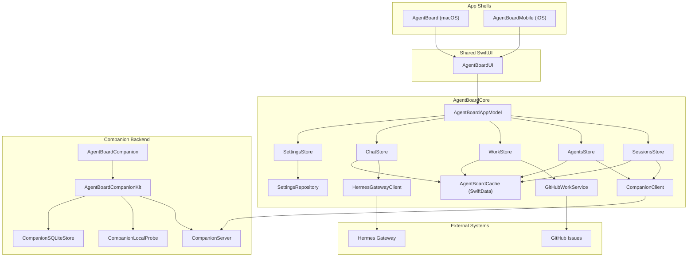
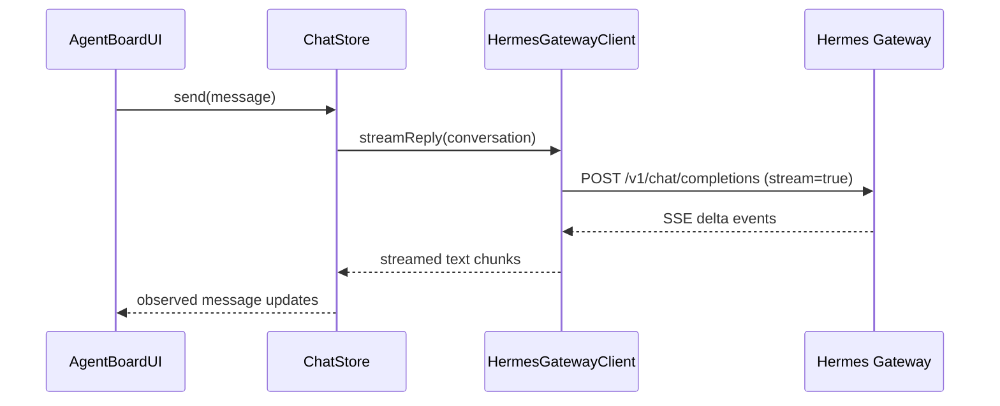
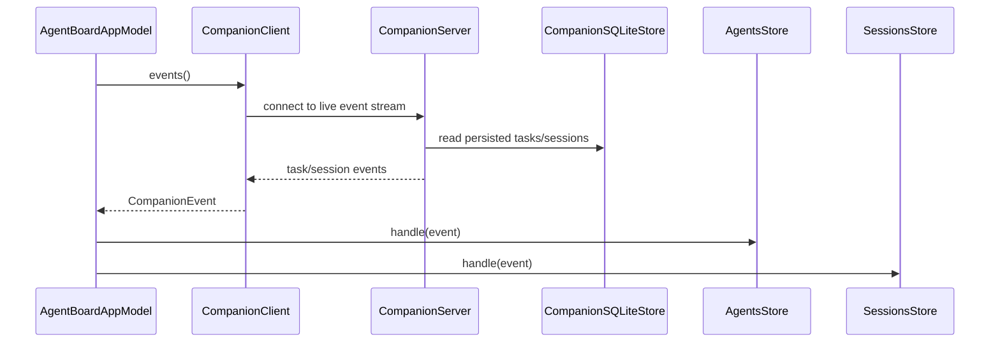

# AgentBoard — Service Architecture

## Active Product Architecture

AgentBoard now ships as a Hermes-first SwiftUI app family:

- `AgentBoard` is the macOS shell.
- `AgentBoardMobile` is the iOS shell.
- `AgentBoardUI` contains shared SwiftUI screens and components.
- `AgentBoardCore` owns the shared state, models, services, and persistence.
- `AgentBoardCompanion` and `AgentBoardCompanionKit` provide the execution-state backend.

The earlier OpenClaw, beads, tmux-monitor, and canvas-heavy prototype has been retired from the active app.

## Platform Shells

| Surface | Navigation model | Responsibility |
|--------|------------------|----------------|
| macOS app | `NavigationSplitView` | Sidebar, detail presentation, desktop-first density |
| iOS app | `TabView` + `NavigationStack` | Mobile routing and compact presentation |

Platform-specific behavior should stay in the app-shell targets. Shared workflows belong in `AgentBoardUI` and `AgentBoardCore`.

## Shared Dependency Graph

```mermaid
flowchart TD
    subgraph Apps["App Shells"]
        Mac["AgentBoard (macOS)"]
        Mobile["AgentBoardMobile (iOS)"]
    end

    subgraph SharedUI["Shared SwiftUI"]
        UI["AgentBoardUI"]
    end

    subgraph Core["AgentBoardCore"]
        AppModel["AgentBoardAppModel"]
        ChatStore["ChatStore"]
        WorkStore["WorkStore"]
        AgentsStore["AgentsStore"]
        SessionsStore["SessionsStore"]
        SettingsStore["SettingsStore"]
        Cache["AgentBoardCache (SwiftData)"]
        SettingsRepo["SettingsRepository"]
        HermesClient["HermesGatewayClient"]
        GitHubService["GitHubWorkService"]
        CompanionClient["CompanionClient"]
    end

    subgraph Companion["Companion Backend"]
        CompanionTool["AgentBoardCompanion"]
        CompanionKit["AgentBoardCompanionKit"]
        SQLite["CompanionSQLiteStore"]
        Probe["CompanionLocalProbe"]
        Server["CompanionServer"]
    end

    subgraph External["External Systems"]
        Hermes["Hermes Gateway"]
        GitHub["GitHub Issues"]
    end

    Mac --> UI
    Mobile --> UI
    UI --> AppModel

    AppModel --> SettingsStore
    AppModel --> ChatStore
    AppModel --> WorkStore
    AppModel --> AgentsStore
    AppModel --> SessionsStore

    SettingsStore --> SettingsRepo
    ChatStore --> Cache
    WorkStore --> Cache
    AgentsStore --> Cache
    SessionsStore --> Cache

    ChatStore --> HermesClient
    WorkStore --> GitHubService
    AgentsStore --> CompanionClient
    SessionsStore --> CompanionClient

    HermesClient --> Hermes
    GitHubService --> GitHub

    CompanionTool --> CompanionKit
    CompanionKit --> SQLite
    CompanionKit --> Probe
    CompanionKit --> Server
    CompanionClient --> Server
```

## Source Of Truth Split

| Domain | Source of truth | Client entry point |
|-------|------------------|--------------------|
| Chat | Hermes gateway | `HermesGatewayClient` |
| Work items | GitHub Issues | `GitHubWorkService` |
| Agent tasks and sessions | Companion service | `CompanionClient` |
| Local cache | SwiftData snapshots | `AgentBoardCache` |
| Settings | User defaults + Keychain-backed settings repository | `SettingsRepository` |

## Key Runtime Flows

### Bootstrap

1. `AgentBoardBootstrap.makeLiveAppModel()` constructs the shared services and stores.
2. `SettingsStore` loads persisted Hermes, GitHub, and companion configuration.
3. `ChatStore`, `WorkStore`, `AgentsStore`, and `SessionsStore` hydrate cached snapshots.
4. `AgentBoardAppModel.bootstrap()` starts refresh loops and companion event subscription.

### Chat send

```mermaid
sequenceDiagram
    participant UI as AgentBoardUI
    participant Chat as ChatStore
    participant Hermes as HermesGatewayClient
    participant Gateway as Hermes Gateway

    UI->>Chat: send(message)
    Chat->>Hermes: streamReply(conversation)
    Hermes->>Gateway: POST /v1/chat/completions (stream=true)
    Gateway-->>Hermes: SSE delta events
    Hermes-->>Chat: streamed text chunks
    Chat-->>UI: observed message updates
```

### Companion refresh

```mermaid
sequenceDiagram
    participant App as AgentBoardAppModel
    participant Client as CompanionClient
    participant Server as CompanionServer
    participant Store as CompanionSQLiteStore

    App->>Client: events()
    Client->>Server: connect to live event stream
    Server->>Store: read persisted tasks/sessions
    Server-->>Client: task/session events
    Client-->>App: CompanionEvent
    App->>AgentsStore: handle(event)
    App->>SessionsStore: handle(event)
```

## Persistence

- `AgentBoardCache` stores read-only snapshots for conversations, work items, agents, and sessions.
- `SettingsRepository` persists user preferences and gateway settings.
- Secrets belong in Keychain-backed storage, not in SwiftData payloads.
- `CompanionSQLiteStore` owns the companion database for execution-state records.

## Architectural Guardrails

- Keep platform branching out of `AgentBoardCore` unless a framework wrapper truly requires it.
- New user-facing features should land in `AgentBoardUI` and bind to shared stores rather than introducing app-shell-specific state.
- `project.yml` is the source of truth for targets, schemes, and build settings.
- The repository’s historical prototype documents are archival only and should not guide new implementation work without an explicit migration decision.
